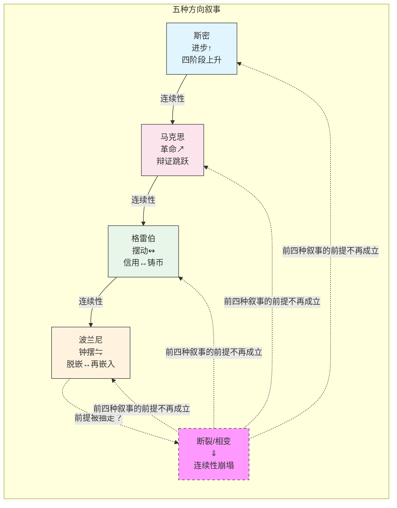

# 第六章：经济史的方向——进步·循环·摇摆·还是断裂？

```
┌─────────────────────────────────────────────────────────────┐
│ 已读: B1 价值 ──→ B2 交换 ──→ B3 货币 ──→ B4 市场 ──→ B5 不平等│
│ B6 ← 你在这                                                 │
│ 接下来: B7 分析起点的政治（最后一章——全书反射层）               │
└─────────────────────────────────────────────────────────────┘
```

> 历史有一个箭头——还是只有一个钟摆？斯密说：箭头向上——从狩猎到畜牧到农业到商业，分工深化、市场扩展、物质进步。马克思说：箭头指向革命——生产力的发展必然与旧的生产关系发生冲突，资本主义不是终点，是通向人类解放的一个阶段。格雷伯说：既不是箭头也不是革命——是**摆动**。人类经济史在信用和铸币之间来回摆动，每次摆动都由暴力与国家权力的进退驱动。波兰尼说：钟摆——市场脱嵌→社会反击→重新嵌入→再次脱嵌，1815-1914的百年和平是钟摆的一次长弧，1914-1945是钟摆的反向回弹。断裂论说：以上四种叙事全都假设**连续性**——如果行星边界崩塌，文明的物质前提被抽走，"方向"这个概念本身还成立吗？

> ⚠️ **传导注：B5→B6 四路径传导不对称**。骨架标注 B5→B6 为「不平等→历史变革」，但这条边实质上是马克思路径的专属通道——阶级矛盾→剩余价值剥削→革命（§5.2→§6.2），传导完整。斯密的要素议价力差异（§5.1）在 B6 中对应的是分工驱动的四阶段进步论——进步论本身不是「不平等驱动历史方向」的理论，斯密路径到 B6 存在逻辑跳层。波兰尼的虚拟商品社会 dislocation（§5.3）对应双重运动钟摆（§6.4）——但钟摆的引擎是市场-社会张力而非不平等本身，波兰尼路径的传导是偏折的。Federici 的再生产劳动隐蔽无偿性（§5.4）在 B6 中**完全没有对应的历史方向叙事**——这是传导链上最严重的断裂。四条路径传导强度极不均等：一条主桥（马克思）+ 两条辅桥（斯密/波兰尼，需读者自行架接）+ 一条未建成（Federici）。读者应将 B5→B6 理解为「B5 提供了理解 B6 历史动力来源的分析工具」，而非「B5 的四条路径在 B6 中各有平行章节」。

---

## 6.0 华尔街的黑色星期四——一个让所有方向叙事同时失效的瞬间 ★发现故事

**1929年10月24日，纽约华尔街。** 上午11点，纽约证券交易所的报价机突然跟不上成交速度——它比实际交易晚了将近两个小时。恐慌在无声中蔓延——交易员看不到价格但能看到周围的人脸色发白。当天收盘时，市值蒸发了数十亿美元。接下来的"黑色星期一"和"黑色星期二"——整个美国股市在四天之内损失了三分之一的价值。

这不是第一次金融危机——南海泡沫、郁金香狂热、1907年恐慌都来过。但1929年的崩盘有一个独特之处：它是发生在**最被理论祝福的**经济体制中的。按照斯密——商业社会是人类经济组织的最高阶段、分工深化自动带来物质进步。按照马克思——没错，危机会来，但那将是资本主义历史的**终点**——社会主义接棒，而不是再来一轮。按照当时正在成形的凯恩斯传统——政府还没有学会逆周期管理。大崩盘击碎的不是一个市场——是三个关于"历史往哪个方向走"的叙事同时失效。

接下来发生了什么——大萧条。美国 GDP 下降 30%，失业率冲到 25%，银行倒闭了三分之一。在欧洲——德国的失业催生了希特勒。"大崩盘→大萧条"的时序是：**市场崩溃→社会崩溃→民主崩溃→战争。** 这不是斯密的"进步"——商业社会不但没有阻止灾难反而成了灾难的导火索。这不是马克思的"革命"——资本主义崩溃后上场的不是社会主义，是法西斯主义。这不是凯恩斯的"可管理的衰退"——没有人知道怎么管。

1929 年没有解答"历史到底有方向还是只有摆动"——但它把这个问题从学术讨论升级为了文明级的追问。本章的五种框架——斯密的进步、马克思的革命、格雷伯的摆动、波兰尼的钟摆、断裂论——都可以被理解为1929年之后、不同思想家对同一个问题的不同回答：**那个在报价机跟不上成交速度的星期四上午——世界到底在往哪个方向走？**

---

## 6.1 斯密：四阶段进步论——分工是历史的引擎

斯密在《国富论》第五卷中提供了一个人类经济史的四阶段叙事：

1. **狩猎社会**：没有私有财产、没有阶级、没有国家。"最低级、最粗野的状态"
2. **畜牧社会**：驯养动物——首次出现了可积累的财富（牲畜）、私有财产和奴隶制
3. **农业社会**：定居、土地私有化、封建等级制
4. **商业社会**：分工深化→劳动生产力激增→市场扩展→个人自由与物质进步

四阶段的驱动力是**分工的深化**。当人们开始专门从事不同的职业——生产力上升——剩余产品出现——交换扩展——制度（私有财产、法律、国家）随之演化来管理日益复杂的经济生活。

这个叙事的深层乐观主义是：**商业社会不仅是效率最高的经济组织方式——也是道德上最优的。** 商业依赖信任与合作——"商人比领主更文明"。商业使个体从封建依附关系中"解放"出来——变成自我决定的自由行动者。

**[E024]** 斯密的进步叙事塑造了两百年来大多数关于"发展"和"现代化"的讨论。它的力量在于：它把经济史讲成了一个**上升的箭头**——每一步都是对前一步的改进。它的局限在于：它不能解释为什么每一步都伴随着某些人的被强制驱逐、被剥夺土地、和被从传统生计中"连根拔起"。进步叙事中的"进步"总是有方向的——它描述的是**一部分人的进步**——同时描述（或不描述）的是**另一部分人的失去**。

---

## 6.2 马克思：辩证革命论——生产力与生产关系的矛盾

马克思接过了斯密的四阶段叙事——但给了它一个革命性的翻转。

在马克思的框架中——历史的驱动力不是"分工的深化"——是**生产力与生产关系的矛盾**。

- **生产力**：人类的劳动能力、工具、技术、知识——生产能力
- **生产关系**：所有权关系、阶级关系——谁控制生产资料、谁占有剩余产品

当生产力发展到一定水平——现存的生产关系变成了**生产力的桎梏**。封建制曾经促进了早期的工业和贸易——但当商业资本主义的扩展需要自由劳动力和统一市场时——封建的土地关系和行会制度成了障碍。资本主义打破了封建桎梏——释放了前所未有的生产力——但资本主义也生产了它自己的掘墓人：社会化大生产与私人占有的矛盾——生产越来越社会化（整个社会像一个工厂一样协作），但剩余价值仍然被少数私人资本家占有。

**辩证革命论的核心：历史的"方向"不是一条平滑向上的线——而是量变到质变的跳跃。** 长期的演化积累——矛盾激化——革命性断裂——新的社会形态诞生。

**[E025]** 马克思的历史叙事和斯密的根本区别不在"乐观还是悲观"——在"动力是什么"。斯密：分工→交换→专业化→生产力上升→制度演化。马克思：生产力与生产关系的矛盾→阶级斗争→革命→新社会形态。斯密的方向是**积累性的**——每一阶段的改进是延续的。马克思的方向是**断裂性的**——每一个新社会形态是通过旧形态的危机和阶级斗争的激烈爆发而**产生**的——它不是演化的延续，是革命的跳跃。马克思晚期——Amy Allen(2024)论证——放弃了单线进化论但保留了**必然性**和**进步性**：资本主义因其内部矛盾必然被更高形式取代——那个形式将是人类的解放。

---

## 6.3 格雷伯：信用-铸币摆动论——暴力驱动历史周期

格雷伯（2011）给了经济史一个完全不同于斯密和马克思的方向叙事。在他的框架中——历史不是上升的箭头——不是指向革命的阶梯——而是**在信用和铸币之间的摆动**。

**信用时代**：货币主要以信用形式存在——虚拟的、账簿式的、基于人际信任的。邻里之间"欠来欠去"——没有实物硬币——只有道德义务构成的复杂网络。信用时代对应的是帝国的稳定期、长距离贸易的繁荣、社会关系网络稠密化的时期。

**铸币时代**：当信用网络崩塌——战争、征服、奴役——贵金属硬币重新占据了主导。铸币是"暴力的计量表"——它将不可量化的人际道德债务转化为可精确计算的金银重量。铸币时代对应的是大规模战争、国家的暴力扩张、奴隶制和征服的高峰期。

格雷伯的叙事不是"信用=好、铸币=坏"——虽然他的政治同情明显在信用一边。他的洞见是：**摆动本身是结构性的。** 信用系统不稳定——因为"欠来欠去"的社会在危机时刻需要**终结债务的机制**（禧年、拒付、革命）。铸币系统也不稳定——因为它依赖持续的暴力和征服来维持贵金属的流动性；当战争和奴隶制到达极限——铸币系统自身也会崩塌回信用。

2024-2025年出现了一个重要经验修正：Weisweiler(2022)对格雷伯的历史分期进行了系统性质疑——晚期罗马的货币和奴隶制数据直接反驳了格雷伯的某些关键主张。"摆动论"作为一个**分析框架**仍然有解释力——但它作为一个**经验历史叙事**需要被修正。

**[E026]** 格雷伯的摆动论和斯密/马克思的根本不同：**历史没有方向——只有摆动。** 不是进步——是交替。不是箭头——是钟摆。进步叙事相信每一个新阶段都"更好"——马克思相信历史有一个解放性的终点——格雷伯不相信。摆动论中的历史——严格来说——是循环往复的。每一次摆动都产生了不同的制度形态——但每次摆动都受制于同一种深层动力：信用网络的内部不稳定性+暴力对信任网络的破坏+新的信用网络在暴力消退后的重建。

---

## 6.4 波兰尼：双重运动论——脱嵌与再嵌入的钟摆

波兰尼（1944）给经济史提供了第四种方向叙事：**双重运动。**

市场脱嵌（自我调节的市场试图从社会关系中挣脱出来——将劳动力、土地、货币虚拟商品化）→社会自我保护（社会通过各种形式的集体行动——工会、法规、福利国家、保守主义、乃至法西斯主义——将自己重新嵌入市场的运作中）→新的平衡（市场被重新嵌入社会的政治需求中——价格机制受制于社会安全网的约束）。

1815-1914年的百年和平——是市场脱嵌的"长弧"——金本位、自由贸易、自由劳动力市场——三大支柱支撑了一个世纪的相对和平与物质扩张。

1914-1945年的崩溃——是脱嵌反噬——金本位的逻辑在大萧条中将世界推向紧缩和法西斯主义。

1945-1980年的"嵌入式自由主义"——是再嵌入——布雷顿森林体系将国际金融重新嵌入国家政策的框架中、福利国家将劳动力市场重新嵌入社会安全网中。

1980年至今——是新一轮脱嵌——新自由主义将金融、劳动力、公共服务重新推向市场。

波兰尼的叙事是**钟摆——不是箭头。** "每一轮脱嵌都会引发新一轮的自我保护。" 钟摆不会停在"嵌入"的位置——因为嵌入的成本（效率损失、官僚僵化、既得利益者对福利制度的捕获）在长期中会重新激活"脱嵌"的推力。钟摆也不会停在"脱嵌"的位置——因为脱嵌的社会破坏——失业、不平等、环境崩溃、社会纽带的解体——会激活反脱嵌的反击。

---



## 6.5 断裂/相变论——如果地球有上限，"方向"还成立吗？

前面四个叙事情——斯密的进步、马克思的革命、格雷伯的摆动、波兰尼的钟摆——共享一个默认为前提：**人类文明的物质连续性是给定的。**

断裂论从行星边界科学获取它的出发点。行星边界框架已在 Ch1 §1.4 中详述——Rockström 等人(2023 年更新)确定的九个行星边界中六个已被突破——此处聚焦它的**方向论含义**：如果文明的物质基础（稳定的气候、可再生的生态系统服务、清洁的水源）正在被摧毁，文明连续性的物质前提是否正在被抽走？

断裂论不是一个"预测"——它是一个**分析可能性的框架**。在断裂叙事的逻辑中：
- 斯密的"四阶段进步论"——假设了每一阶段的物质基础向上兼容
- 马克思的"革命论"——假设了新的更高形式的物质可能性
- 格雷伯的"摆动论"——假设了信用-铸币周期在稳定的文明边界内摆动
- 波兰尼的"钟摆论"——假设了每一轮钟摆摆动回来时文明的物质条件大致不变

**五种框架不是竞争者——它们构成一个完整的分析象限。** 斯密和马克思描述历史在**连续**的条件下怎么走——怎么向上、怎么断裂而进步。格雷伯和波兰尼描述历史在**波动**的条件下怎么走——怎么来回摆动而维系着同一个结构。断裂论描述**当连续性本身的前提被抽走**——"方向"这个概念需要被重写。五条线各司其职——任何人都不能只拿一条线来看。

**再生产劳动的断裂维度。** Ch5 §5.4 的 Federici-Folbre 线在历史方向上有一种未被充分展开的含义。如果再生产劳动——家务、照护、育儿、情感工作——是劳动力商品得以持续存在的隐蔽前提，那么"连续性"假设就不仅关乎行星边界，也关乎照护基础设施。气候压力（极端天气、粮食短缺、大规模迁徙）会首先压垮哪些人？恰恰是那些已经在无偿承担再生产劳动的人——女性、儿童、老人。当社区互助网络在气候压力下瓦解，当代际知识传递（如何在这片土地耕作、如何在这个生态位上生存）失去物质载体，再生产劳动的隐蔽无偿性就从"不平等的一个维度"变成了**文明连续性的另一个断裂面**。"进步还是循环"的争论——无论是斯密的市场乐观主义还是格雷伯的摆动论——都假设了再生产劳动的底层会继续默默运转。断裂论迫使这个假设浮出水面：如果再生产劳动的物质基础（照护基础设施、代际知识传递、社区互助网络）在气候压力下瓦解，"历史方向"的连续性前提就被从另一个角度——不是生物物理流，而是照护流——抽走。这不是在 Ch5 的 Federici 线和 Ch6 的断裂论之间强行架桥——这是指出两者共享一个被前四章遗漏的问题：**连续性的前提不只是"自然持续馈赠"——也是"人持续照料人"。**

**[E027]** 断裂论不是"预测文明崩溃"——它是在问一个被前四种叙事回避的问题：如果增长的生物物理上限是硬的——"进步还是循环"这个选择本身是不是一个错误的问题？在断裂论的视角中，2031年的读者可能会问："2026年的人为什么还在争论进步还是循环——他们没看到文明连续性的物质前提正在他们脚下融化吗？"

---

## 经典深层注：格雷伯的摆动论——经验基础正在被拆解，但问题意识仍然深刻

*以下内容基于Graeber《债：第一个5000年》(2011)的四轮深层提取。*

### Weisweiler 2022——古代史学界系统性质疑

2022年牛津大学出版社出版了John Weisweiler主编的文集——10位古代史专家逐条检验Graeber的历史论断。核心发现：**晚期罗马帝国的铸币使用不是减少了而是增加了。** 考古证据显示4-5世纪铸币饱和度更高。奴隶制没有衰退（Kyle Harper）。贸易网络保持完整。大庄园没有走向自给自足。Papaconstantinou质疑Graeber为何连Chris Wickham的《Framing the Early Middle Ages》都没有参考。

### "以物易物"语义操作

Graeber将barter严格定义为"即时现货交易"——使得"以物易物不存在"变成同义反复。任何包含时间维度的交易都被他归类为"信用"——不管有没有使用货币。Caroline Humphrey的原文讨论了"延迟以物易物"——Graeber选择性忽略。货币经济学家Hummel指出更尖锐的矛盾：如果信用交易先于现货交易，那么信用交易要么是"以物易物信用"，要么已经使用了交易媒介——不可能两者都不是。

### 白银——恰好是门格尔预测会自发成为货币的商品

Graeber声称白银在苏美尔是通过神庙行政系统而非市场成为货币。Thibaud（2023）显示图景更复杂：白银在长途贸易中已有市场角色。Murphy指出这个"巧合"Graeber不愿正视：苏美尔神庙选择白银——**恰好是Menger理论预测会自发成为货币的商品。** Graeber重排了因果链顺序——用不同的词描述了同一机制。

### 禧年需要主权者

Graeber的政治寄托（周期性取消债务）恰恰需要他理论中定义为核心问题的东西：拥有宣布取消债务权力的主权权威。古代禧年是国王宣布的。现代禧年（Rolling Jubilee）依赖在市场中购买债务然后取消——这本身就是一种市场操作。Beaman和Ferguson（2025）的深层批评：如果所有的制度化义务都被视为Schuld（罪/债），"拒绝"就成为唯一的政治行动——而"构建替代性信用系统"的可能性就从想象中消失。

---

*▸ 下一章——最后一根骨头：分析起点的政治。七章写到现在——你应该已经看到了一件事：每一次理论分歧的根源都不在"答案"——在你看不见的、已经被当作前提的那一步。选个体还是选阶级——已经决定了你能看到什么、看不到什么。*
